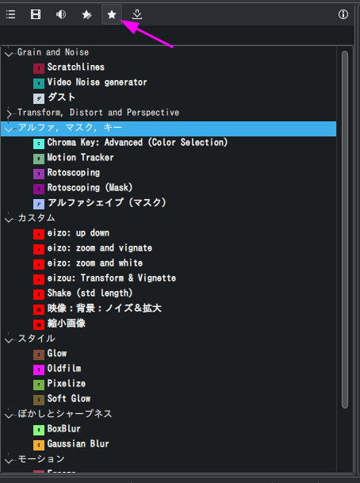
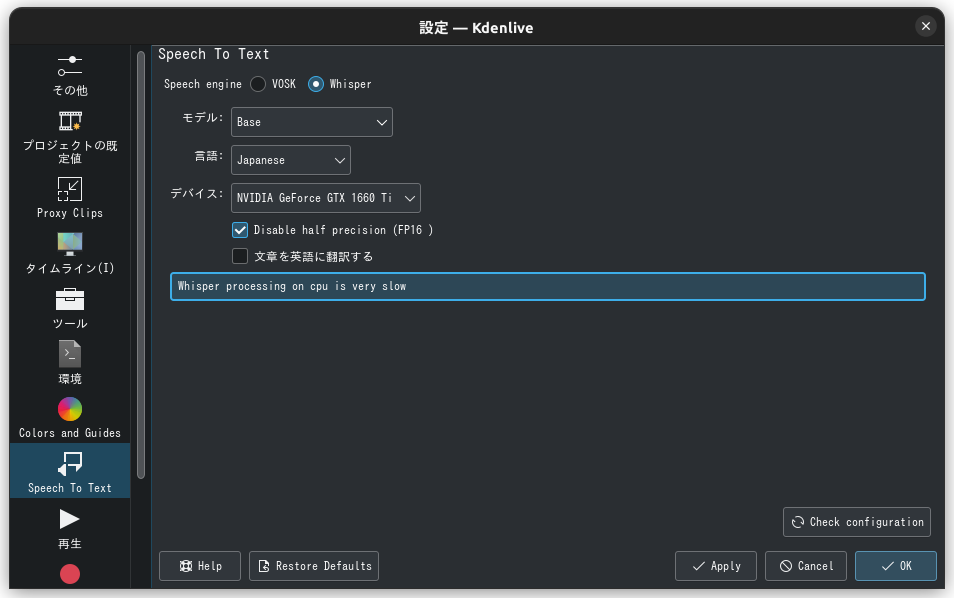
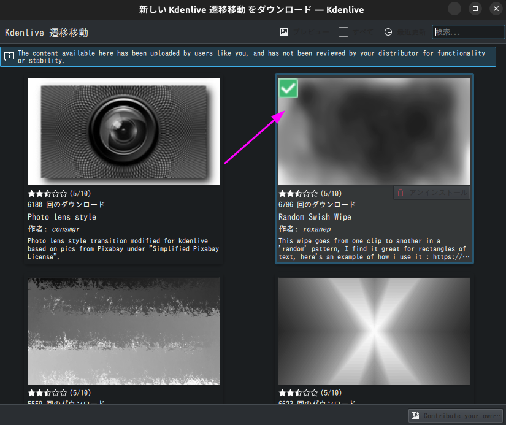
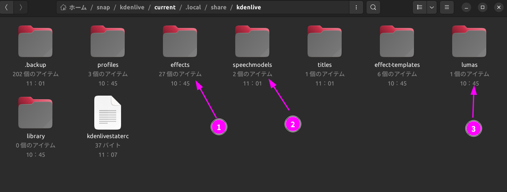
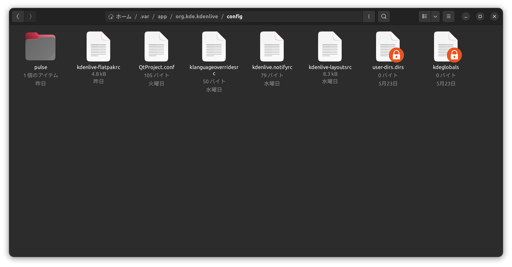

# snapアプリケーションの設定をflatpakアプリケーションに引き継ぐ
## はじめに
`snap`版アプリケーションを使っていたが`flatpak`版アプリケーションに乗り換えたとき、それらの設定を引き継ぎたいと思いました。
例えば今回、`kdenlive`の`snap`を使っていましたが、日本語入力問題を`snap`では解決できなかったことから`flatpak`版へ乗り換えました。



`snap`版では多くのカスタムエフェクトを作成していましたが、これを手動で作り直すのには骨が折れます。
また`Speech to text`用の学習モデルを`kdenlive`にインストールしていたり、カスタムコンポジションをネットからインストールしたりしていました。
それら全てを`kdenlive`にもう一度インストールするのは非現実的だと思いました。

今回のように`snap`から`flatpak`へ設定ファイルや学習モデルを移行することに限らず、システムを再インストールしたときの作業（あるいはインストール用スクリプト構築）にも、今回の知見は役立ちます。

今回は`kdenlive`のみを扱いますが、基本的に他のアプリケーションの場合も手順は一緒なので、個々にその方法を記しておきます。

## `snap`と`flatpak`の設定ファイル
`snap`版の場合、`~/snap/kdenlive/current/`ディレクトリ以下。
- `~/snap/kdenlive/current/.config/kdenlive-snaprc`
  - 設定ファイル
- `~/snap/kdenlive/current/.local/share/kdenlive/effects/`
- `~/snap/kdenlive/current/.local/share/kdenlive/speechmodels/`
- `~/snap/kdenlive/current/.local/share/kdenlive/effects/`
```bash
tee -a | xsel -b
.
├── .config
（中略）
│   ├── kdeglobals
│   ├── kdenlive-layoutsrc
│   ├── kdenlive-snaprc  # ←rcファイル
│   ├── kdenlive.notifyrc
（中略）
├── .last_revision
├── .local
│   └── share
│       ├── RecentDocuments
（中略）
│       ├── kdenlive
│       │   ├── .backup
（中略）
│       │   ├── effect-templates  # エフェクトファイル群
│       │   │   ├── Glitch-Effect-V1.xml
│       │   │   ├── LM-Creative-LUT.xml
│       │   │   ├── Smear-Transition-IN.xml
│       │   │   ├── VHS.xml
│       │   │   ├── Zoom-Transition-V1-IN.xml
│       │   │   └── vhs-effect.xml
│       │   ├── effects
│       │   │   ├── Glitch-Effect-V1.xml
│       │   │   ├── Shake-std-length.xml
│       │   │   ├── audio: voice gain.xml
│       │   │   ├── eizo: blue & chalactor.xml
│       │   │   ├── eizo: blur & charactor.xml
│       │   │   ├── eizo: up down.xml
│       │   │   ├── eizo: zoom and vignate.xml
│       │   │   ├── eizo: zoom and white.xml
│       │   │   ├── eizou: Transform & Vignette.xml
│       │   │   ├── jimaku: background.xml
│       │   │   ├── jimaku: bottom.xml
│       │   │   ├── jimaku: middle.xml
│       │   │   ├── jimaku: upper.xml
│       │   │   ├── presets
│       │   │   │   ├── avfilter.alimiter.json
│       │   │   │   ├── avfilter.highpass.json
│       │   │   │   ├── avfilter.noise.json
│       │   │   │   ├── frei0r.coloradj_RGB.json
│       │   │   │   ├── frei0r.distort0r.json
│       │   │   │   ├── frei0r.vignette.json
│       │   │   │   └── qtblend.json
│       │   │   ├── 映像：ノイズ＆Old Film.xml
│       │   │   ├── 映像：画面右上タイトル.xml
│       │   │   ├── 映像：拡大して回転：背景.xml
│       │   │   ├── 映像：切り抜き＆ノイズ.xml
│       │   │   ├── 映像：全てのタイトル.xml
│       │   │   ├── 映像：背景：ノイズ＆拡大.xml
│       │   │   ├── 映像：文字列下段.xml
│       │   │   ├── 映像：文字列上段.xml
│       │   │   ├── 映像：文字列中段.xml
│       │   │   ├── 音声：タイトルコール.xml
│       │   │   ├── 音声：ナレーション.xml
│       │   │   └── 縮小画像.xml
│       │   ├── kdenlivestaterc
│       │   ├── library
│       │   ├── lumas  # ← 追加インストールしたコンポジットファイル
│       │   │   └── HD
│       │   │       ├── 135114-Mandelbrot1 blured.pgm
（中略）
│       │   ├── profiles
│       │   │   ├── customprofile0
│       │   │   ├── customprofile1
│       │   │   └── video4linux
│       │   ├── speechmodels  # ← Speech to text用学習モデル
│       │   │   ├── vosk-model-ja-0.22
│       │   │   │   ├── README
│       │   │   │   ├── am
│       │   │   │   │   └── final.mdl
（中略）
└── .nv
    └── ComputeCache
```

1. カスタムエフェクトファイル
2. Speech to text 学習モデルファイル
3. 追加インストールしたコンポジットファイル

対して`flatpak`版の場合は`~/.var/app/org.kde.kdenlive/config`のように、こちらも隠しディレクトリとなっています。

```bash
tree -L 2
.
├── QtProject.conf
├── kdeglobals
├── kdenlive-flatpakrc  # ←rcファイル
├── kdenlive-layoutsrc
├── kdenlive.notifyrc
├── klanguageoverridesrc
├── pulse
│   └── cookie
└── user-dirs.dirs

1 directory, 8 files
```


